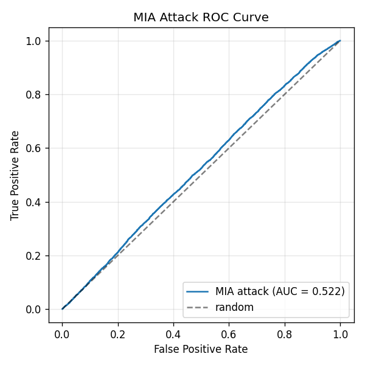

# Results

## Stage 1: probability + loss features

Logistic regression attack classifier on 2 features (prob, loss). Trained on shadow features, evaluated on target.

**Models**

| Model | Train acc | Test acc | Gap |
|---|---|---|---|
| Target | 0.789 | 0.753 | +0.036 |
| Shadow | 0.736 | 0.718 | +0.018 |

**Attack**

| Metric | Value |
|---|---|
| Accuracy | 0.673 |
| AUC | 0.522 |
| TPR @ FPR=1% | 0.010 |
| TPR @ FPR=10% | 0.104 |

AUC barely above random. Small generalisation gap leaves little signal for the attack to extract.

---

## Stage 2: TODO

encoder distance as a third feature. Pairs seen during training may sit at characteristically different latent distances than unseen pairs.

1. Extend `score_pairs` in notebook 02 to return encoder distance.
2. Add `enc_dist` column to both feature CSVs.
3. Set `features = ["prob", "loss", "enc_dist"]` in notebook 03.

Threat model shifts from pure black-box to encoder-accessible.